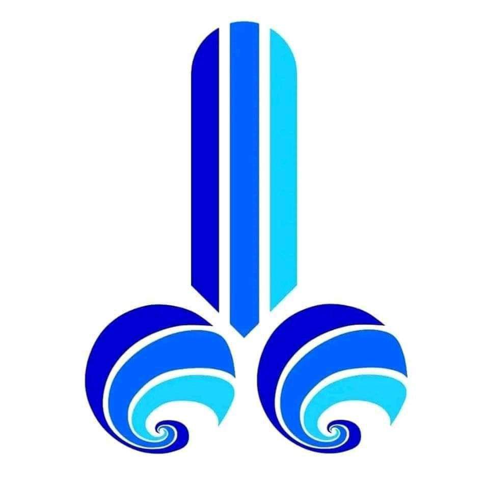
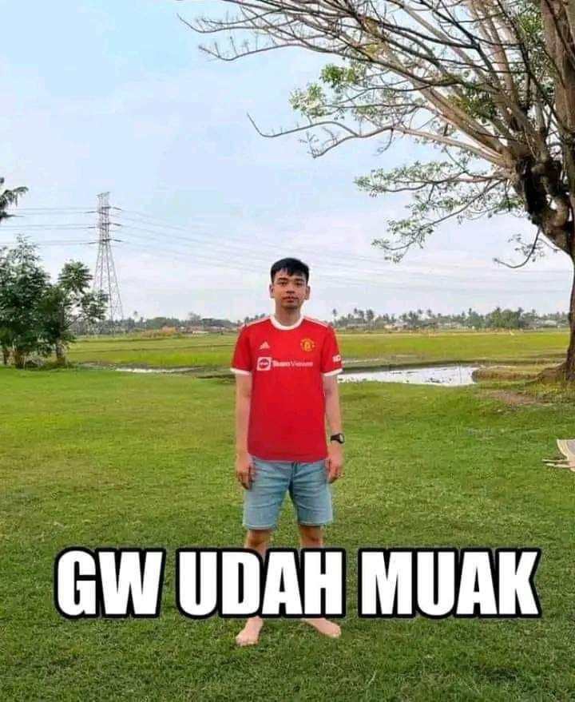
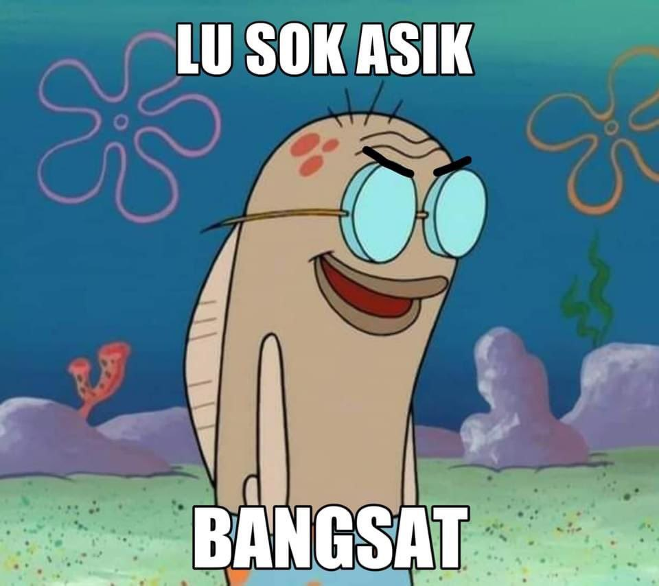
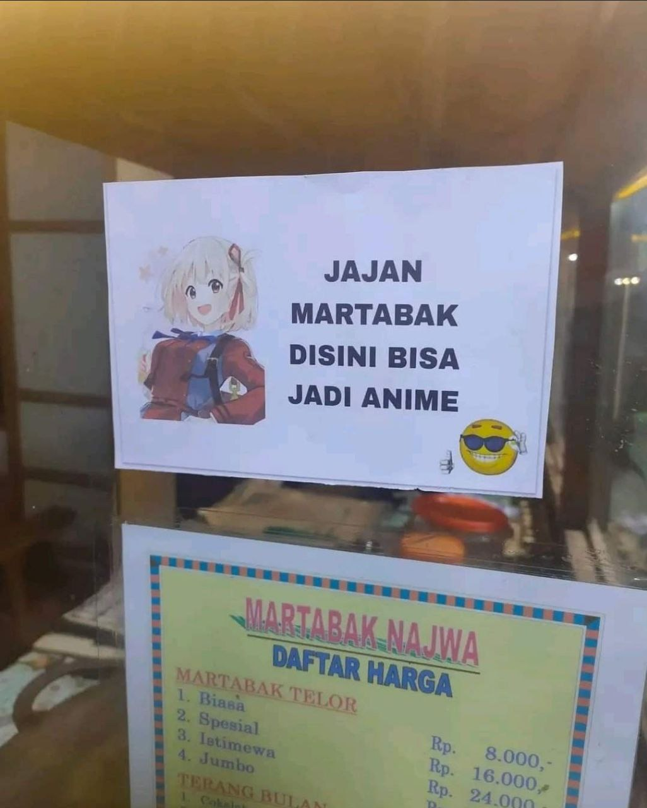
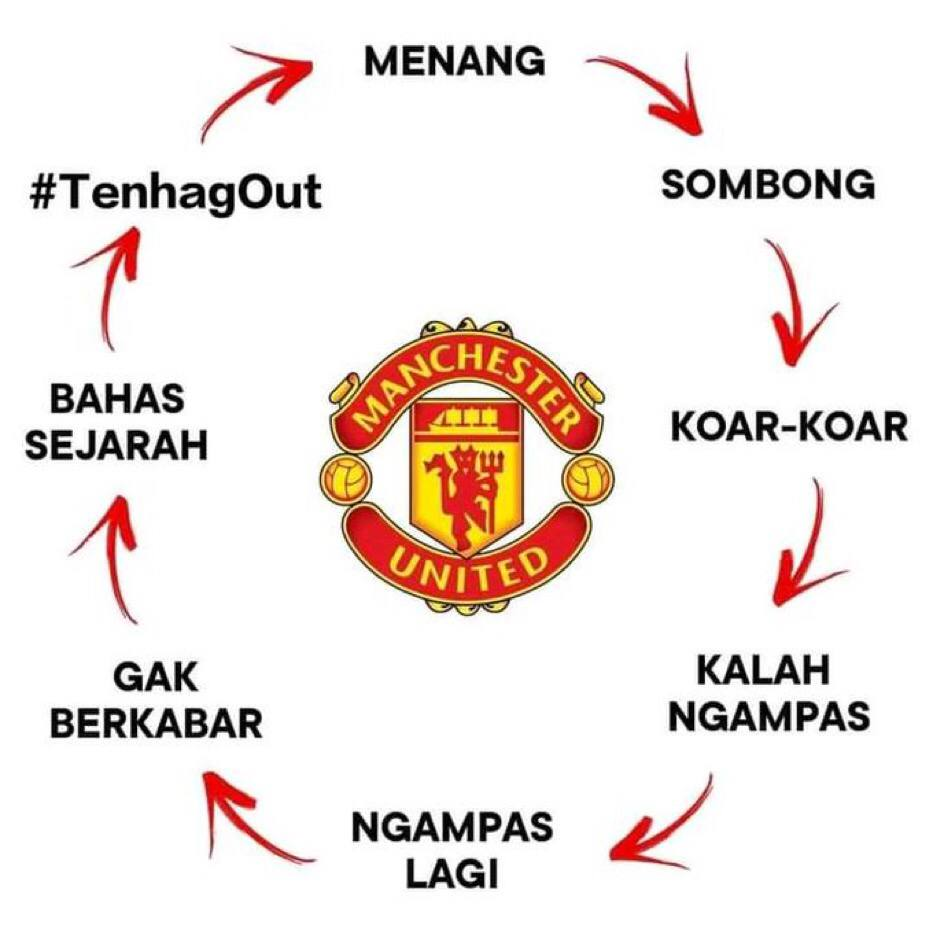

# Project Tugas Akhir

di semester akhir ini akan dilaksanakan kegiatan yang bernama tugas akhir dan skripsi oleh karena itu dibuat lah sebuah repository back up sebagai penyimpanan berbasis cloud yang tidak akan hilang (kecuali di blokir KEMINFO tapi bisa pake vpn 😋).

## Thanks for Support:

yang support gua bikin ini:

- Orang tua
- gua sendiri
- laptop sama pc
- neb1 and friends
- system information 19 (include dosen)
- ~~ayang~~ (cukup di pap tiap hari dari admin slot aja dan waifu)
- and etc. Ga bisa disebutin semua, kebanyakan.

## Mengapa harus 3,5 tahun?

sebagai mahasiswa yang kampusnya mulai tidak jelas sistemnya, gua berniat untuk cepet2 keluar dari kampus. Oleh karena itu gua mengambil tugas akhir lebih cepat

## bang gua mau liat file2 lu dong

isi filenya ini gua niatnya bakal naro :

- proposal pdf (coming soon)
- ppt proposal pptx
- skripsi (coming soon)

## gua liat - liat kok anaknya ambis banget

sebenernya gua kaga ambis kok, gua cuma ikut alur aja dan pengen cepet - cepet selesai kuliah. mungkin berkat do'a ortu gua yang selalu support

## bang kok lu orangnya asik banget?

kata coach justin

## cita cita lu apaan dah?

cita - cita gua sih kek gini

## lu sebenernya banyak duitkan?

**OHH JELAS LAA**

## Motivasi lu di semester akhir ini apa?

motivasi gua ngga ada tapi gini sih

## kok bisa happy tiap hari?

karena banyaknya komedi disini, apalagi ini

### sekian dan Terima kasih
